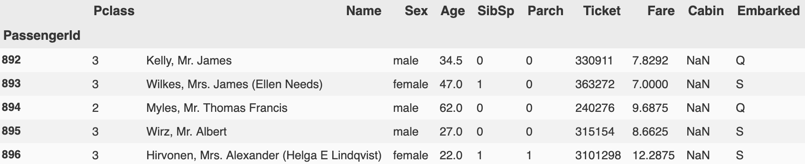
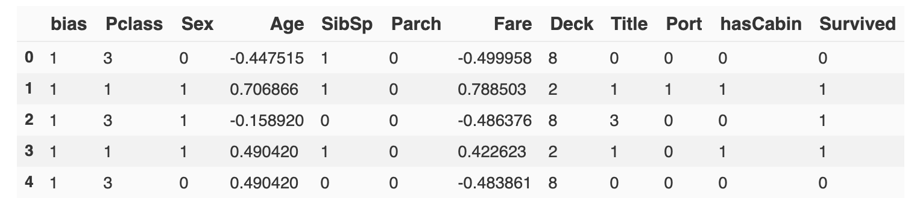
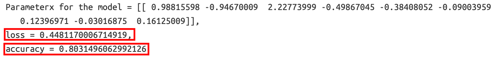

# <a href='https://www.kaggle.com/c/titanic/overview'>kaggle_competition_titanic </a>
Supervised learning for binary classification using Logistic regression


## Requirements and Installation

Python3 must be installed on the system and added to the system path.

- __For BSD based OS__, run  `source initiate_ml.sh` to set up a virtualenv, install required packages and run the jupyter notebook
- The shell script contains the following commands:

```shell
$ python -m pip install --upgrade pip
$ pip install virtualenv
$ python3 -m venv venv_ml
$ source venv_ml/bin/activate
$ pip install -r requirements.txt
$ ipython kernel install --user --name=titanic_ml_kernel
$ jupyter notebook titanic_survival_logistic_regr.ipynb
```

-   __For Windows__, set up a conda virtualenv and install the requirements file using `conda install --file requirements.txt` from inside the conda virtualenv.

-   __Important__: Make sure to change the current kernel to `titanic_ml_kernel` once inside the jupyter notebook window.

## Introduction to dataset

__Training dataset__


__Testing dataset__


__Preparing and cleaning data for analysis:__

Given all `NaN` values have been replaced by a placeholder value of `-1000`, we get the following Kernel Density Plots for the numeric variables in the dataset.

<br/>

Percent of Null Values           |  Number of Unique Values
:-------------------------------:|:----------------------:
  |  

    We drop the rows with NaN values for the Embarked and the Fare column in the training dataset as they only have 0.15% and 0.07% of missing values.
    (This only amounts to 3 observations/rows)

    The Cabin column has 77.5% of values missing and it does not make sense to impute this proportion of missing values. So, we create another column `hasCabin` to flag whether a passenger has a cabin assigned to them.

    The NaN values in the Age column are filled with imputed values.
    These imputed values are the age values randomly selected within one std dev of the mean of the age of the respective ticket class and sex from the tables given below.

Mean of Age segmented by Passenger Class and Sex  |  Std Dev of Age segmented by Passenger Class and Sex
:-------------------------------:|:----------------------:
  |    |

__The training dataset after cleaning and normalization.__

   * The categorical features `Sex` and `Embarked` have been converted into columns with numerical features. For `Sex`, males are represented by 0 and females by 1. `Embarked` has been converted to `Port`, where 0, 1 and 2 mean ports S, C and Q respectively. (Note: creating two columns isMale and isFemale is incorrect as it leads to two features with high correlation and the `dummy variable trap`)
   * `Title` is engineered from the names of the passengers. i.e. Mr, Mrs, Master and Miss would represent 0, 1, 2, and 3 respectively.
   * `Deck` represents the section of the ship passengers with Cabin numbers were assigned to. Here, 8 would mean the passenger had no Cabin hence Deck assigned to them.

__Correlation Matrix__


For our logistic regression and subsequent machine learning models, we drop the `hasCabin` and `Port(Embarked)` Features to limit overfitting.
*   `hasCabin` has a high correlation between Deck, so `hasCabin` can be removed as `Deck` gives a more detailed level of information
*   It is not clear how the port of embarkment would affect survivability so `Port(Embarked)` is dropped as well

## Exploratory Data analysis

General statistics for the entire dataset (train and test)  |  Correlation Matrix of numerical columns in test dataset
:-------------------------------:|:----------------------:
  |    |

    There is a negative correlation between Passenger Class and survival rate as expected as more Passengers from the better classes (Smaller the better) are expected to survive.
    This is also true for Fare, which is positively correlated with the survival rate.

__Boxplot of Age segmented by Passenger Class and Sex__


Survival rate by Passenger Class and Sex  |  No. of Survivors(1) and Deceased(0) by Sex
:-------------------------------:|:----------------------:
  |    |

    The survival rate and the number of passengers who survived was higher for females than males.

__Average fare of passengers by Sex and Class__


    Women in almost all Passenger Classes were paying on average a higher fare than men which also meant they had a higher chance of survival as Fare is positively correlated with survivability.

## Logistic Regression

    For our logistic regression we use a linear logistic model with no polynomial features.

__Loss curve after 50000 iterations with an alpha(learning rate) of 0.019 and lambda(regularization factor) of 0.99__


__Final loss and accuracy on test data__


__Accuracy on test data from Kaggle using a linear logistic model__


### Acknowledgements
-   Kaggle dataset available from <https://www.kaggle.com/c/titanic/overview>
-   Utility.py utility function library created from another repository on custom Linear and Logistic regression created from scratch using numpy for calculation and matplotlib for plotting.
